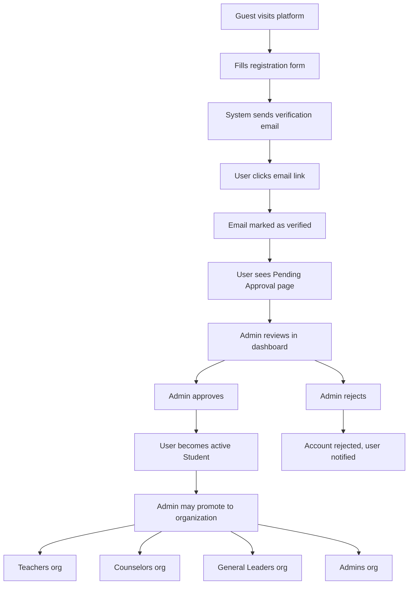

# Auth & Onboarding Implementation Guide

This document is the single source of truth for implementing **Registration**, **Login**, and **Organization-based Access Control** in Focus Hub. Every team member should read this fully before writing any code.

---

## Table of Contents

- [1. Overview and Architecture Decisions](#1-overview-and-architecture-decisions)
- [2. Task Board](#2-task-board)
- [3. Git Branching and Commit Convention](#3-git-branching-and-commit-convention)
- [4. Backend Implementation Guide](#4-backend-implementation-guide)
- [5. Frontend Implementation Guide](#5-frontend-implementation-guide)
- [6. Access Control via Organizations](#6-access-control-via-organizations)
- [7. Testing Requirements](#7-testing-requirements)

---

## 1. Overview and Architecture Decisions

### What We Are Building

A registration and login system where:

1. Users register with their university details
2. They verify their email via a link sent to their inbox
3. An admin must manually approve the account before the user can access the platform
4. Every approved user starts as a **Student** (base role)
5. Admins can promote users to elevated roles by adding them to BetterAuth **Organizations**

### Key Decisions

| Decision | Choice | Reason |
|----------|--------|--------|
| Auth library | [BetterAuth](https://better-auth.com) | Built-in email verification, organization plugin, admin plugin, Next.js integration |
| Database | MongoDB | Team-agreed persistence layer |
| Role model | BetterAuth Organizations | A user can belong to multiple orgs simultaneously (e.g., both "teachers" and "general-leaders") |
| First registrant | Auto-promoted to Admin | Via `databaseHooks.user.create.after` checking if user count === 1 |
| Email verification | BetterAuth `emailVerification` plugin | Link-based, `sendOnSignUp: true` |
| Admin approval | Custom `approved` field on user | Boolean field managed by admin, checked on every login |

### Registration Fields

| Field | Type | Required | Provided By |
|-------|------|----------|-------------|
| `email` | string | Yes | User |
| `name` | string | Yes | User (full name as on university ID) |
| `password` | string | Yes | User |
| `universityId` | string | Yes | User (helps admin verify identity) |
| `year` | number | Yes | User (university year) |
| `department` | string | No | User |
| `approved` | boolean | -- | System (default `false`, set by admin) |

### User Journey Flow



### Two-Step Verification

```
Step 1: Email Verification (automated)
  - User registers -> BetterAuth sends verification link
  - User clicks link -> emailVerified = true
  - Without this, user cannot log in at all

Step 2: Admin Approval (manual)
  - Admin sees user in pending list
  - Admin clicks approve -> approved = true
  - Without this, user sees "Pending Approval" page after login
```

---

## 2. Task Board

### Team Members

| Name | Role | Track |
|------|------|-------|
| **Negasa Reta** | Backend | Infrastructure (BetterAuth config, MongoDB, email, hooks) |
| **Ayana Samuel** | Backend | Domain/Application (entities, DTOs, use cases, API routes) |
| **Abenezer Terefe** | Backend | Organizations/Testing (permissions, middleware, tests) |
| **Firomsa Hika** | Frontend | Auth client setup + Registration |
| **Gemechu Alemu** | Frontend | Login + Verification flow |
| **Sabona Waktole** | Frontend | Admin dashboard |

### Backend Tasks

| ID | Task | Assignee | Depends On | Branch |
|----|------|----------|------------|--------|
| `BE-AUTH-01` | BetterAuth server setup + MongoDB adapter + custom user fields (`universityId`, `year`, `department`, `approved`) | **Negasa Reta** | -- | `back-main-auth-setup` |
| `BE-AUTH-02` | Email verification config (`sendVerificationEmail`, `sendOnSignUp`, callback URL handling) | **Negasa Reta** | -- | `back-main-auth-setup` |
| `BE-AUTH-03` | First-user auto-admin promotion (`databaseHooks.user.create.after`) | **Negasa Reta** | -- | `back-main-auth-setup` |
| `BE-AUTH-04` | Auth domain layer: `UserStatus` enum, auth error types, DTOs (`ApproveUserDTO`, `PendingUserResponseDTO`), `AuthRepository` port | **Ayana Samuel** | -- (pure types, no deps) | `back-main-auth-domain` |
| `BE-AUTH-05` | Admin approval use cases: `approveUser`, `rejectUser`, `getPendingUsers` + API routes at `/api/v1/admin/users` | **Ayana Samuel** | `BE-AUTH-04` (own prior work) | `back-main-auth-approval` |
| `BE-AUTH-06` | Login dual-verification guard: block login if email not verified OR not admin-approved | **Ayana Samuel** | `BE-AUTH-04` (own prior work) | `back-main-auth-approval` |
| `BE-AUTH-07` | Organization permissions: `createAccessControl` statements, role-to-org mapping, default org seed script | **Abenezer Terefe** | -- (standalone config) | `back-main-auth-orgs` |
| `BE-AUTH-08` | Organization access control middleware + org management API routes at `/api/v1/admin/organizations` | **Abenezer Terefe** | `BE-AUTH-07` (own prior work) | `back-main-auth-orgs` |
| `BE-AUTH-09` | Unit tests for auth domain entities and use cases + integration tests for auth API routes | **Abenezer Terefe** | `BE-AUTH-04` (shared types from Ayana) | `back-main-auth-tests` |

### Frontend Tasks

| ID | Task | Assignee | Depends On | Branch |
|----|------|----------|------------|--------|
| `FE-AUTH-01` | Auth client setup: `createAuthClient` + `organizationClient` + `adminClient` + type inference from server | **Firomsa Hika** | -- | `front-main-auth-client` |
| `FE-AUTH-02` | Registration page + form (all fields, client-side validation, `signUp.email` call) | **Firomsa Hika** | `FE-AUTH-01` (own prior work) | `front-main-auth-register` |
| `FE-AUTH-03` | Login page: email/password form, error handling for unverified (403) and unapproved states | **Gemechu Alemu** | -- (can mock auth client) | `front-main-auth-login` |
| `FE-AUTH-04` | Email verification callback page at `/verify-email?token=...` | **Gemechu Alemu** | -- (standalone page) | `front-main-auth-verify` |
| `FE-AUTH-05` | Pending approval status page (shown after email verified, before admin approves) | **Gemechu Alemu** | -- (standalone page) | `front-main-auth-pending` |
| `FE-AUTH-06` | Admin dashboard: user approval panel (list pending users, approve/reject actions) | **Sabona Waktole** | -- (can use mock data) | `front-main-admin-users` |
| `FE-AUTH-07` | Admin dashboard: organization/role management panel (list orgs, add/remove members) | **Sabona Waktole** | -- (can use mock data) | `front-main-admin-orgs` |

### Parallelism Strategy

**Backend** -- each person owns a distinct architectural layer:

- **Negasa** touches only `src/core/auth/infrastructure/config/` (BetterAuth config files). Nobody else edits these.
- **Ayana** touches only `src/core/auth/domain/`, `src/core/auth/application/`, and the admin API routes. Nobody else edits these.
- **Abenezer** touches only the permissions/org config and `__tests__/`. Nobody else edits these.
- **Sync point**: all three should agree on the types defined in `BE-AUTH-04` before starting (a 30-minute call). After that, everyone works independently.

**Frontend** -- each person owns distinct pages:

- **Firomsa** creates the shared auth client file (~1 hour), then works on `/register`. Others can start immediately with a placeholder import.
- **Gemechu** builds `/login`, `/verify-email`, `/pending-approval` -- all self-contained pages. Can build and test with mocked `authClient` responses.
- **Sabona** builds `/admin/users` and `/admin/organizations` -- completely independent admin UI. Can build with hardcoded mock data and connect to real APIs later.

---

## 3. Git Branching and Commit Convention

### Branch Creation

All branches follow the existing strategy documented in [docs/branching-strategy.md](branching-strategy.md).

**Backend developers:**

```bash
git checkout back-main && git pull origin back-main
git checkout -b back-main-auth-setup       # Negasa
git checkout -b back-main-auth-domain      # Ayana
git checkout -b back-main-auth-orgs        # Abenezer
```

**Frontend developers:**

```bash
git checkout front-main && git pull origin front-main
git checkout -b front-main-auth-client     # Firomsa
git checkout -b front-main-auth-login      # Gemechu
git checkout -b front-main-admin-users     # Sabona
```

### Branch-to-Task Mapping

| Branch | Tasks | Developer |
|--------|-------|-----------|
| `back-main-auth-setup` | BE-AUTH-01, BE-AUTH-02, BE-AUTH-03 | Negasa |
| `back-main-auth-domain` | BE-AUTH-04 | Ayana |
| `back-main-auth-approval` | BE-AUTH-05, BE-AUTH-06 | Ayana |
| `back-main-auth-orgs` | BE-AUTH-07, BE-AUTH-08 | Abenezer |
| `back-main-auth-tests` | BE-AUTH-09 | Abenezer |
| `front-main-auth-client` | FE-AUTH-01 | Firomsa |
| `front-main-auth-register` | FE-AUTH-02 | Firomsa |
| `front-main-auth-login` | FE-AUTH-03 | Gemechu |
| `front-main-auth-verify` | FE-AUTH-04 | Gemechu |
| `front-main-auth-pending` | FE-AUTH-05 | Gemechu |
| `front-main-admin-users` | FE-AUTH-06 | Sabona |
| `front-main-admin-orgs` | FE-AUTH-07 | Sabona |

### Commit Message Examples

```
feat(auth): add BetterAuth server config with MongoDB adapter
feat(auth): configure email verification with sendOnSignUp
feat(auth): add first-user auto-admin promotion hook
feat(auth): define UserStatus enum and auth error types
feat(auth): implement approve-user use case and API route
feat(auth): add organization permissions and access control
feat(auth): create registration form with university fields
feat(auth): add login page with dual-verification error handling
feat(auth): build admin user approval dashboard panel
test(auth): add unit tests for approve-user use case
test(auth): add integration tests for admin approval API
fix(auth): resolve email verification callback redirect
refactor(auth): extract shared auth types to domain barrel
```

### PR Workflow

1. PR target for backend: `back-main`
2. PR target for frontend: `front-main`
3. Require 1 approval from a teammate on your team
4. Squash merge into team branch
5. Keep PRs small: one branch = one PR (do NOT bundle multiple branches into one PR)

---

## 4. Backend Implementation Guide

### 4.1 File Structure Overview

```
src/core/auth/
  domain/
    user-status.enum.ts
    auth.errors.ts
    index.ts
  application/
    dtos/auth.dto.ts
    ports/auth-repository.port.ts
    use-cases/
      approve-user.use-case.ts
      reject-user.use-case.ts
      get-pending-users.use-case.ts
    index.ts
  infrastructure/
    config/
      auth.ts
      auth-client.ts
      permissions.ts
    repositories/
      mongodb-auth.repository.ts
  index.ts

src/app/api/auth/[...all]/route.ts
src/app/api/v1/admin/users/route.ts
src/app/api/v1/admin/users/[id]/approve/route.ts
src/app/api/v1/admin/organizations/route.ts
```

---

### 4.2 BE-AUTH-01 -- BetterAuth Server Setup (Negasa)

**File:** `src/core/auth/infrastructure/config/auth.ts`

This is the central BetterAuth configuration. It must:

- Initialize BetterAuth with the MongoDB adapter
- Register plugins: `organization`, `admin`, `nextCookies`
- Define custom user fields via `user.additionalFields`
- Configure `emailVerification` and `emailAndPassword`
- Set up `databaseHooks` for first-user admin promotion

**Expected structure:**

```typescript
import { betterAuth } from "better-auth"
import { organization } from "better-auth/plugins"
import { admin } from "better-auth/plugins"
import { nextCookies } from "better-auth/next-js"
import { MongoClient } from "mongodb"

const client = new MongoClient(process.env.MONGODB_URI!)
const db = client.db()

export const auth = betterAuth({
  database: {
    type: "mongodb",
    db,
  },

  user: {
    additionalFields: {
      universityId: {
        type: "string",
        required: true,
        input: true,
      },
      year: {
        type: "number",
        required: true,
        input: true,
      },
      department: {
        type: "string",
        required: false,
        input: true,
      },
      approved: {
        type: "boolean",
        required: false,
        defaultValue: false,
        input: false, // users cannot set this themselves
      },
    },
  },

  emailAndPassword: {
    enabled: true,
    requireEmailVerification: true,
  },

  emailVerification: {
    sendOnSignUp: true,
    sendVerificationEmail: async ({ user, url, token }, request) => {
      // Use your email service (Resend, Nodemailer, etc.)
      // Send email to user.email with the verification URL
    },
    autoSignInAfterVerification: true,
  },

  databaseHooks: {
    user: {
      create: {
        after: async (user) => {
          // First-user auto-admin: check if this is the only user
          // If user count === 1, set role to admin via auth.api
        },
      },
    },
  },

  plugins: [
    organization({
      allowUserToCreateOrganization: async (user) => {
        // Only admins can create organizations
        const session = await auth.api.getSession({ headers: new Headers() })
        return false // implement proper admin check
      },
    }),
    admin(),
    nextCookies(), // must be last
  ],
})
```

**File:** `src/app/api/auth/[...all]/route.ts`

The BetterAuth catch-all API route handler:

```typescript
import { auth } from "@/core/auth/infrastructure/config/auth"
import { toNextJsHandler } from "better-auth/next-js"

export const { POST, GET } = toNextJsHandler(auth)
```

**Environment variables needed** (add to `.env.local`):

```
MONGODB_URI=mongodb://localhost:27017/focus-hub
BETTER_AUTH_SECRET=<random-32-char-string>
BETTER_AUTH_URL=http://localhost:3000
```

**Packages to install:**

```bash
pnpm add better-auth mongodb
```

**Tests to write (Negasa):**
- Verify that the auth instance initializes without errors
- Verify that custom fields are present on signup response

---

### 4.3 BE-AUTH-02 -- Email Verification (Negasa)

This is configured inside the same `auth.ts` file from BE-AUTH-01. The `sendVerificationEmail` function must:

1. Accept `{ user, url, token }` from BetterAuth
2. Send an email to `user.email` containing the verification `url`
3. The `url` points to BetterAuth's built-in verification endpoint

**Callback handling:** When the user clicks the link:

- If token is valid: `emailVerified` is set to `true`, user is redirected to the `callbackURL`
- If token is invalid: user is redirected to `callbackURL?error=invalid_token`

Configure the callback URL to point to `/verify-email` on the frontend.

**Email service:** Choose one of:
- [Resend](https://resend.com) (recommended, free tier available)
- Nodemailer with SMTP
- Any transactional email API

**Tests to write (Negasa):**
- Verify that `sendVerificationEmail` is called on signup (mock the email function)

---

### 4.4 BE-AUTH-03 -- First-User Auto-Admin (Negasa)

Inside `databaseHooks.user.create.after` in `auth.ts`:

1. After a user is created, count total users in the database
2. If count === 1, this is the first user
3. Use `auth.api.admin.setRole` to set the user's role to `"admin"`
4. Set the user's `approved` field to `true` (auto-approve the first user)
5. Create the default organizations: `teachers`, `counselors`, `general-leaders`, `admins`
6. Add the first user to the `admins` organization as owner

```typescript
// Inside databaseHooks.user.create.after
after: async (user) => {
  const userCount = await db.collection("user").countDocuments()
  if (userCount === 1) {
    // This is the first user -- make them admin
    await auth.api.admin.setRole({
      body: { userId: user.id, role: "admin" },
    })
    // Auto-approve
    await db.collection("user").updateOne(
      { _id: user.id },
      { $set: { approved: true } }
    )
    // Create default organizations (see BE-AUTH-07 for the full list)
    // Add user to admins org as owner
  }
}
```

**Tests to write (Negasa):**
- First user gets admin role
- Second user does NOT get admin role
- First user is auto-approved

---

### 4.5 BE-AUTH-04 -- Auth Domain Layer (Ayana)

**File:** `src/core/auth/domain/user-status.enum.ts`

```typescript
export const UserStatus = {
  PENDING: "pending",
  EMAIL_VERIFIED: "email_verified",
  APPROVED: "approved",
  REJECTED: "rejected",
} as const

export type UserStatus = (typeof UserStatus)[keyof typeof UserStatus]
```

**File:** `src/core/auth/domain/auth.errors.ts`

```typescript
import { DomainError } from "@/core/shared/domain"

export class EmailNotVerifiedError extends DomainError {
  constructor() {
    super("Email address has not been verified")
  }
}

export class UserNotApprovedError extends DomainError {
  constructor() {
    super("Account has not been approved by an administrator")
  }
}

export class UserAlreadyApprovedError extends DomainError {
  constructor() {
    super("User account is already approved")
  }
}
```

**File:** `src/core/auth/domain/index.ts`

Barrel-export all domain types.

**File:** `src/core/auth/application/dtos/auth.dto.ts`

```typescript
export type ApproveUserDTO = {
  userId: string
}

export type RejectUserDTO = {
  userId: string
  reason?: string
}

export type PendingUserResponseDTO = {
  id: string
  email: string
  name: string
  universityId: string
  year: number
  department: string | null
  emailVerified: boolean
  createdAt: string
}

export type RegisterDTO = {
  email: string
  name: string
  password: string
  universityId: string
  year: number
  department?: string
}
```

**File:** `src/core/auth/application/ports/auth-repository.port.ts`

```typescript
export type AuthRepository = {
  findPendingUsers: () => Promise<PendingUserResponseDTO[]>
  approveUser: (userId: string) => Promise<void>
  rejectUser: (userId: string, reason?: string) => Promise<void>
  isApproved: (userId: string) => Promise<boolean>
  getUserCount: () => Promise<number>
}
```

**File:** `src/core/auth/application/index.ts`

Barrel-export DTOs, ports, and use cases.

---

### 4.6 BE-AUTH-05 -- Approval Use Cases + API Routes (Ayana)

**File:** `src/core/auth/application/use-cases/approve-user.use-case.ts`

```typescript
import type { AuthRepository } from "../ports/auth-repository.port"
import type { ApproveUserDTO } from "../dtos/auth.dto"

type ApproveUserDependencies = {
  authRepository: AuthRepository
}

export const createApproveUserUseCase = (deps: ApproveUserDependencies) => {
  return async (dto: ApproveUserDTO): Promise<void> => {
    await deps.authRepository.approveUser(dto.userId)
  }
}
```

Follow the same pattern for `reject-user.use-case.ts` and `get-pending-users.use-case.ts`.

**File:** `src/app/api/v1/admin/users/route.ts`

```typescript
import { NextResponse } from "next/server"
import { auth } from "@/core/auth/infrastructure/config/auth"
import { headers } from "next/headers"
// import getPendingUsers from dependencies

export const GET = async () => {
  // 1. Check session via auth.api.getSession({ headers: await headers() })
  // 2. Verify caller is admin
  // 3. Call getPendingUsers use case
  // 4. Return { data: users }
}
```

**File:** `src/app/api/v1/admin/users/[id]/approve/route.ts`

```typescript
export const POST = async (
  request: NextRequest,
  { params }: { params: { id: string } }
) => {
  // 1. Check session, verify admin
  // 2. Read body for { action: "approve" | "reject", reason?: string }
  // 3. Call approveUser or rejectUser use case
  // 4. Return success response
}
```

**Wire dependencies** in `src/core/shared/infrastructure/config/dependencies.ts`:

```typescript
import { createApproveUserUseCase } from "@/core/auth"
// ... wire with repository
export const approveUser = createApproveUserUseCase({ authRepository })
export const getPendingUsers = createGetPendingUsersUseCase({ authRepository })
```

**Tests to write (Ayana):**
- `approve-user.use-case.ts` calls repository correctly
- `get-pending-users.use-case.ts` returns correct DTO shape
- API route returns 401 for unauthenticated requests
- API route returns 403 for non-admin users

---

### 4.7 BE-AUTH-06 -- Login Dual-Verification Guard (Ayana)

When a user logs in, two conditions must be met:

1. **Email verified** -- handled automatically by BetterAuth when `requireEmailVerification: true`
2. **Admin approved** -- must be checked manually

The check can be implemented using BetterAuth's `databaseHooks.session.create.before`:

```typescript
// Inside auth.ts databaseHooks
session: {
  create: {
    before: async (session, ctx) => {
      const user = await db.collection("user").findOne({ _id: session.userId })
      if (!user?.approved) {
        throw new APIError("FORBIDDEN", {
          message: "Your account is pending admin approval",
        })
      }
      return { data: session }
    },
  },
},
```

Alternatively, implement this as middleware at the application level. The key requirement is: **if `approved === false`, the user must not be able to access any protected route.**

The frontend will handle this by:
- Catching the 403 error on login
- Redirecting to the `/pending-approval` page

---

### 4.8 BE-AUTH-07 -- Organization Permissions (Abenezer)

**File:** `src/core/auth/infrastructure/config/permissions.ts`

This file must be **client-safe** (no server-only imports like MongoDB). It defines the access control statements and roles used by both server and client.

```typescript
import { createAccessControl } from "better-auth/plugins/access"
import {
  defaultStatements,
  adminAc,
} from "better-auth/plugins/organization/access"

export const statement = {
  ...defaultStatements,
  announcement: ["create", "read", "update", "delete"],
  blogPost: ["create", "read", "update", "delete"],
  task: ["create", "read", "update", "delete", "assign"],
  learningResource: ["create", "read", "update", "delete"],
  counseling: ["create", "read"],
  userManagement: ["approve", "reject", "ban", "promote"],
} as const

export const ac = createAccessControl(statement)

export const member = ac.newRole({
  announcement: ["read"],
  blogPost: ["read"],
  task: ["read"],
  learningResource: ["read"],
})

export const teacher = ac.newRole({
  announcement: ["read"],
  blogPost: ["read"],
  task: ["create", "read", "update", "delete", "assign"],
  learningResource: ["create", "read", "update", "delete"],
})

export const counselor = ac.newRole({
  announcement: ["read"],
  blogPost: ["read"],
  counseling: ["create", "read"],
})

export const generalLeader = ac.newRole({
  announcement: ["create", "read", "update", "delete"],
  blogPost: ["create", "read", "update", "delete"],
})

export const platformAdmin = ac.newRole({
  ...adminAc.statements,
  announcement: ["create", "read", "update", "delete"],
  blogPost: ["create", "read", "update", "delete"],
  task: ["create", "read", "update", "delete", "assign"],
  learningResource: ["create", "read", "update", "delete"],
  counseling: ["create", "read"],
  userManagement: ["approve", "reject", "ban", "promote"],
})
```

**Default organizations to seed** (done in BE-AUTH-03's first-user hook or via a separate seed script):

| Org Slug | Org Name | Platform Role | Description |
|----------|----------|---------------|-------------|
| `teachers` | Teachers | Teacher | Can create tasks, assignments, roadmaps |
| `counselors` | Counselors | Counselor | Can provide counseling support |
| `general-leaders` | General Leaders | General Leader | Can post announcements, blog posts |
| `admins` | Admins | Admin | Full platform control |

**Wire into auth.ts** (Negasa will import from this file):

```typescript
import { ac, member, teacher, counselor, generalLeader, platformAdmin } from "./permissions"

// In the organization plugin config:
organization({
  ac,
  roles: {
    member,
    admin: platformAdmin,
    owner: platformAdmin,
    teacher,
    counselor,
    generalLeader,
  },
  allowUserToCreateOrganization: async (user) => {
    // Check if user is in admins org
    return false // only allow via server-side API
  },
}),
```

**Tests to write (Abenezer):**
- Verify permission statements compile without errors
- Verify each role has expected permissions
- Verify `member` role cannot access `userManagement`

---

### 4.9 BE-AUTH-08 -- Org Access Control Middleware + API Routes (Abenezer)

**Middleware pattern** for checking organization membership in API routes:

```typescript
import { auth } from "@/core/auth/infrastructure/config/auth"
import { headers } from "next/headers"

const requireOrganization = async (orgSlug: string) => {
  const session = await auth.api.getSession({ headers: await headers() })
  if (!session) throw new Error("Not authenticated")

  const hasPermission = await auth.api.hasPermission({
    headers: await headers(),
    body: {
      permission: { /* check relevant permission */ },
    },
  })

  if (!hasPermission) throw new Error("Insufficient permissions")
  return session
}
```

**File:** `src/app/api/v1/admin/organizations/route.ts`

```typescript
// GET: list all organizations (admin only)
// POST: add a user to an organization (admin only)
//   body: { userId, organizationSlug, role }
```

This route is how the admin "promotes" a user. Adding a user to the `teachers` organization means they now have the Teacher role.

---

### 4.10 BE-AUTH-09 -- Tests (Abenezer)

**Test file locations** (following existing test structure):

```
__tests__/
  fixtures/
    auth.fixture.ts              -- MOCK_PENDING_USER, MOCK_APPROVED_USER, etc.
    factories/
      auth.factory.ts            -- buildUserProps(), buildPendingUserDTO()
  unit/
    core/
      domain/
        auth.errors.test.ts
      use-cases/
        approve-user.use-case.test.ts
        get-pending-users.use-case.test.ts
  integration/
    api/
      admin-users.integration.test.ts
      auth-register.integration.test.ts
```

**What to test:**

| Test Type | What | File |
|-----------|------|------|
| Unit | `UserStatus` enum values | `auth.errors.test.ts` |
| Unit | `approveUser` use case calls repo | `approve-user.use-case.test.ts` |
| Unit | `getPendingUsers` returns correct shape | `get-pending-users.use-case.test.ts` |
| Integration | `POST /api/auth/sign-up/email` with custom fields | `auth-register.integration.test.ts` |
| Integration | `GET /api/v1/admin/users` returns pending users | `admin-users.integration.test.ts` |
| Integration | `POST /api/v1/admin/users/[id]/approve` changes user status | `admin-users.integration.test.ts` |

**Fixture pattern** (follow existing conventions in `__tests__/fixtures/`):

```typescript
// __tests__/fixtures/auth.fixture.ts
export const MOCK_REGISTER_DTO: RegisterDTO = {
  email: "student@astu.edu.et",
  name: "Test Student",
  password: "securePassword123",
  universityId: "ASTU/2024/001",
  year: 3,
  department: "Computer Science",
}

export const MOCK_PENDING_USER: PendingUserResponseDTO = {
  id: "user-001",
  email: "student@astu.edu.et",
  name: "Test Student",
  universityId: "ASTU/2024/001",
  year: 3,
  department: "Computer Science",
  emailVerified: true,
  createdAt: "2026-03-10T00:00:00.000Z",
}
```

---

## 5. Frontend Implementation Guide

### 5.1 File Structure Overview

```
src/lib/
  auth-client.ts                          -- BetterAuth client instance
  auth-permissions.ts                     -- Re-exports from permissions.ts (client-safe)

src/features/auth/
  components/
    registration-form.tsx                 -- "use client"
    login-form.tsx                        -- "use client"
    pending-approval-card.tsx             -- "use client"
    index.ts                              -- Barrel export
  actions/auth.actions.ts                 -- Server actions
  types.ts                                -- Type aliases
  index.ts                                -- Feature barrel export

src/app/(auth)/
  layout.tsx                              -- Centered auth layout shell
  register/page.tsx
  login/page.tsx
  verify-email/page.tsx
  pending-approval/page.tsx

src/app/(dashboard)/admin/
  users/page.tsx
  organizations/page.tsx
```

---

### 5.2 FE-AUTH-01 -- Auth Client Setup (Firomsa)

**File:** `src/lib/auth-client.ts`

```typescript
import { createAuthClient } from "better-auth/react"
import { organizationClient } from "better-auth/client/plugins"
import { adminClient } from "better-auth/client/plugins"
import { ac, member, teacher, counselor, generalLeader, platformAdmin } from "@/core/auth/infrastructure/config/permissions"

export const authClient = createAuthClient({
  plugins: [
    organizationClient({
      ac,
      roles: {
        member,
        admin: platformAdmin,
        owner: platformAdmin,
        teacher,
        counselor,
        generalLeader,
      },
    }),
    adminClient({
      ac,
      roles: {
        admin: platformAdmin,
        user: member,
      },
    }),
  ],
})

export type Session = typeof authClient.$Infer.Session
```

**File:** `src/lib/auth-permissions.ts`

```typescript
export {
  ac,
  member,
  teacher,
  counselor,
  generalLeader,
  platformAdmin,
} from "@/core/auth/infrastructure/config/permissions"
```

---

### 5.3 FE-AUTH-02 -- Registration Page (Firomsa)

**File:** `src/app/(auth)/register/page.tsx`

Server component that renders the `RegistrationForm`.

**File:** `src/features/auth/components/registration-form.tsx`

Client component (`"use client"`) containing a form with:

| Field | Component | Validation |
|-------|-----------|------------|
| Full Name | `<Input>` from `@/components/ui` | Required, min 3 chars. Show helper: "Please enter your name as it appears on your university ID" |
| Email | `<Input type="email">` | Required, valid email format |
| University ID | `<Input>` | Required, non-empty |
| Year | `<Input type="number">` | Required, between 1 and 7 |
| Department | `<Input>` | Optional |
| Password | `<Input type="password">` | Required, min 8 chars |
| Confirm Password | `<Input type="password">` | Must match password |

**On submit:**

```typescript
const handleSubmit = async (formData: FormData) => {
  const { data, error } = await authClient.signUp.email({
    email: formData.get("email") as string,
    password: formData.get("password") as string,
    name: formData.get("name") as string,
    universityId: formData.get("universityId") as string,
    year: Number(formData.get("year")),
    department: formData.get("department") as string || undefined,
  })

  if (error) {
    // Show error message
    return
  }

  // Redirect to a "Check your email" page
  router.push("/verify-email?sent=true")
}
```

**Accessibility:**
- All inputs must have labels, `aria-label`, and error states
- Form must be navigable via keyboard (tab order)
- Submit button shows loading state while submitting

---

### 5.4 FE-AUTH-03 -- Login Page (Gemechu)

**File:** `src/app/(auth)/login/page.tsx`

Server component that renders the `LoginForm`.

**File:** `src/features/auth/components/login-form.tsx`

Client component with email and password fields.

**On submit:**

```typescript
const handleSubmit = async (formData: FormData) => {
  const { data, error } = await authClient.signIn.email({
    email: formData.get("email") as string,
    password: formData.get("password") as string,
  }, {
    onError: (ctx) => {
      if (ctx.error.status === 403) {
        // Could be email not verified OR not approved
        if (ctx.error.message.includes("verify")) {
          setError("Please verify your email first. Check your inbox.")
        } else if (ctx.error.message.includes("approval")) {
          router.push("/pending-approval")
        } else {
          setError(ctx.error.message)
        }
      }
    },
  })

  if (data) {
    router.push("/dashboard")
  }
}
```

**Error states to handle:**
- Invalid credentials (401)
- Email not verified (403 with "verify" message)
- Account not approved (403 with "approval" message)
- Account banned (403 with "banned" message)
- Network error

---

### 5.5 FE-AUTH-04 -- Email Verification Callback (Gemechu)

**File:** `src/app/(auth)/verify-email/page.tsx`

This page handles two scenarios:

1. **`?sent=true`** -- User just registered. Show a message: "We sent a verification link to your email. Please check your inbox and click the link."
2. **`?token=...`** -- User clicked the verification link. Call `authClient.verifyEmail({ query: { token } })` and show success/failure.

```typescript
// If token is present, verify it
const { data, error } = await authClient.verifyEmail({
  query: { token },
})

// On success: show "Email verified! Your account is now pending admin approval."
// With a link to /pending-approval

// On error: show "Invalid or expired link. Please request a new one."
// With a button to resend: authClient.sendVerificationEmail({ email, callbackURL: "/verify-email" })
```

---

### 5.6 FE-AUTH-05 -- Pending Approval Page (Gemechu)

**File:** `src/app/(auth)/pending-approval/page.tsx`

A simple status page shown to users whose email is verified but account is not yet approved.

**Content:**
- Heading: "Account Pending Approval"
- Message: "Your email has been verified. An administrator will review your account shortly. You will receive a notification once your account is approved."
- Show the user's name and university ID (from session if available)
- A "Check Status" button that calls `authClient.useSession()` to re-check
- A "Log Out" button

---

### 5.7 FE-AUTH-06 -- Admin User Approval Panel (Sabona)

**File:** `src/app/(dashboard)/admin/users/page.tsx`

Server component that:
1. Checks session via `auth.api.getSession({ headers: await headers() })`
2. Verifies the user is an admin (member of `admins` org)
3. Fetches pending users from `GET /api/v1/admin/users`
4. Renders the approval panel

**The panel displays a table of pending users:**

| Column | Source |
|--------|--------|
| Name | `user.name` |
| Email | `user.email` |
| University ID | `user.universityId` |
| Year | `user.year` |
| Department | `user.department` |
| Registered | `user.createdAt` (formatted) |
| Actions | Approve / Reject buttons |

**Approve button** calls `POST /api/v1/admin/users/[id]/approve` with `{ action: "approve" }`.

**Reject button** opens a modal for optional rejection reason, then calls the same endpoint with `{ action: "reject", reason: "..." }`.

Use `@/components/ui` primitives: `Button`, `Card`, `Input` (for the reject reason modal).

---

### 5.8 FE-AUTH-07 -- Admin Organization Panel (Sabona)

**File:** `src/app/(dashboard)/admin/organizations/page.tsx`

This page lets admins manage organization membership (i.e., promote/demote users).

**Section 1: Organization list**
- Fetch all organizations via `authClient.organization.list()`
- Show each org with member count

**Section 2: Add member to organization (promote user)**
- Select an organization from a dropdown
- Search/select a user by name or email
- Click "Add to Organization" to promote the user
- Calls `authClient.organization.inviteMember({ organizationId, email, role: "member" })` or the server-side equivalent

**Section 3: View members of an organization**
- Click on an org to see its members
- Show member name, email, and role within the org
- "Remove" button to remove a member from the org

---

## 6. Access Control via Organizations

### Organization-to-Role Mapping

| Org Slug | Platform Role | What Members Can Do |
|----------|---------------|---------------------|
| (none) | Student (base) | View blog posts, view announcements, access learning resources, track own progress |
| `teachers` | Teacher | Everything a Student can do + create tasks, publish assignments, design roadmaps, monitor student progress |
| `counselors` | Counselor | Everything a Student can do + provide counseling, guidance |
| `general-leaders` | General Leader | Everything a Student can do + post announcements, manage blog posts, publish program updates |
| `admins` | Admin | Full platform control: approve users, assign roles, moderate content, manage all resources |

A user can be in **multiple organizations simultaneously**. For example, a user who is both a Teacher and a General Leader would be a member of both the `teachers` and `general-leaders` organizations.

### How to Check Access (Server Side)

```typescript
import { auth } from "@/core/auth/infrastructure/config/auth"
import { headers } from "next/headers"

// Check if user has a specific permission
const canCreateTask = await auth.api.hasPermission({
  headers: await headers(),
  body: {
    permission: {
      task: ["create"],
    },
  },
})

// Check if user is member of a specific organization
const session = await auth.api.getSession({ headers: await headers() })
const orgs = await auth.api.listOrganizations({ headers: await headers() })
const isTeacher = orgs.some((org) => org.slug === "teachers")
```

### How to Check Access (Client Side)

```typescript
import { authClient } from "@/lib/auth-client"

// Using the hook in a component
const { data: orgs } = authClient.useListOrganizations()
const isAdmin = orgs?.some((org) => org.slug === "admins")

// Using hasPermission (async, server roundtrip)
const { data } = await authClient.organization.hasPermission({
  permission: {
    task: ["create"],
  },
})
```

### How Admin Promotes a User

1. Admin opens the Organization Management panel (`/admin/organizations`)
2. Selects an organization (e.g., "Teachers")
3. Searches for the user to promote
4. Adds the user as a member of that organization
5. The user now has all permissions granted by that organization's role
6. The same user can be added to additional organizations for multiple roles

### Route Protection Pattern

For protected pages in `src/app/`, use this pattern in server components:

```typescript
import { auth } from "@/core/auth/infrastructure/config/auth"
import { headers } from "next/headers"
import { redirect } from "next/navigation"

export default async function ProtectedPage() {
  const session = await auth.api.getSession({ headers: await headers() })

  if (!session) {
    redirect("/login")
  }

  if (!session.user.approved) {
    redirect("/pending-approval")
  }

  // For admin-only pages, additionally check org membership
  const orgs = await auth.api.listOrganizations({ headers: await headers() })
  const isAdmin = orgs.some((org) => org.slug === "admins")
  if (!isAdmin) {
    redirect("/dashboard")
  }

  return <div>Admin content here</div>
}
```

### Permission Matrix

| Resource | Student | Teacher | Counselor | General Leader | Admin |
|----------|---------|---------|-----------|----------------|-------|
| View public blog | Yes | Yes | Yes | Yes | Yes |
| View announcements | Yes | Yes | Yes | Yes | Yes |
| Create tasks | -- | Yes | -- | -- | Yes |
| Create blog posts | -- | -- | -- | Yes | Yes |
| Track learning progress | Yes | Yes | -- | -- | Yes |
| Provide counseling | -- | -- | Yes | -- | Yes |
| Approve users | -- | -- | -- | -- | Yes |
| Assign roles (orgs) | -- | -- | -- | -- | Yes |
| Ban/suspend users | -- | -- | -- | -- | Yes |

---

## 7. Testing Requirements

### Test Structure

All tests follow the existing project convention in `__tests__/`:

```
__tests__/
  fixtures/
    auth.fixture.ts
    factories/
      auth.factory.ts
    index.ts                     -- Update to re-export auth fixtures
  unit/
    core/
      domain/
        auth.errors.test.ts
      use-cases/
        approve-user.use-case.test.ts
        reject-user.use-case.test.ts
        get-pending-users.use-case.test.ts
  integration/
    api/
      auth-register.integration.test.ts
      admin-users.integration.test.ts
      admin-organizations.integration.test.ts
```

### Required Unit Tests

| Test File | What It Verifies |
|-----------|-----------------|
| `auth.errors.test.ts` | Custom error classes extend `DomainError`, have correct messages |
| `approve-user.use-case.test.ts` | Calls `authRepository.approveUser` with correct userId; throws on non-existent user |
| `reject-user.use-case.test.ts` | Calls `authRepository.rejectUser` with userId and optional reason |
| `get-pending-users.use-case.test.ts` | Returns array of `PendingUserResponseDTO`; returns empty array when no pending users |

### Required Integration Tests

| Test File | What It Verifies |
|-----------|-----------------|
| `auth-register.integration.test.ts` | `POST /api/auth/sign-up/email` creates user with custom fields; returns 400 for missing required fields |
| `admin-users.integration.test.ts` | `GET /api/v1/admin/users` returns pending users (admin only); returns 401 for unauthenticated; returns 403 for non-admin |
| `admin-organizations.integration.test.ts` | `GET /api/v1/admin/organizations` returns org list; `POST` adds member to org |

### Test Fixture Pattern

Follow the existing convention -- all mock data in `__tests__/fixtures/`, imported by test files:

```typescript
// __tests__/fixtures/auth.fixture.ts
import type { RegisterDTO, PendingUserResponseDTO } from "@/core/auth"

export const MOCK_REGISTER_DTO: RegisterDTO = {
  email: "student@astu.edu.et",
  name: "Test Student",
  password: "securePassword123",
  universityId: "ASTU/2024/001",
  year: 3,
  department: "Computer Science",
}

export const MOCK_PENDING_USER: PendingUserResponseDTO = {
  id: "user-test-001",
  email: "student@astu.edu.et",
  name: "Test Student",
  universityId: "ASTU/2024/001",
  year: 3,
  department: "Computer Science",
  emailVerified: true,
  createdAt: "2026-03-10T00:00:00.000Z",
}
```

```typescript
// __tests__/fixtures/factories/auth.factory.ts
import { MOCK_REGISTER_DTO } from "../auth.fixture"
import type { RegisterDTO } from "@/core/auth"

let counter = 0

export const buildRegisterDTO = (
  overrides?: Partial<RegisterDTO>
): RegisterDTO => ({
  ...MOCK_REGISTER_DTO,
  email: `student-${++counter}@astu.edu.et`,
  ...overrides,
})
```

### Testing Rules

1. **Never hardcode test data inline** -- always import from `__tests__/fixtures/`
2. **Mock the repository port** in unit tests -- do not hit the database
3. **Use factory functions** when you need multiple variations of the same data
4. **Name tests descriptively**: `it("should approve a pending user and set approved to true")`
5. **Test error paths**: verify that unauthorized access returns proper HTTP status codes
