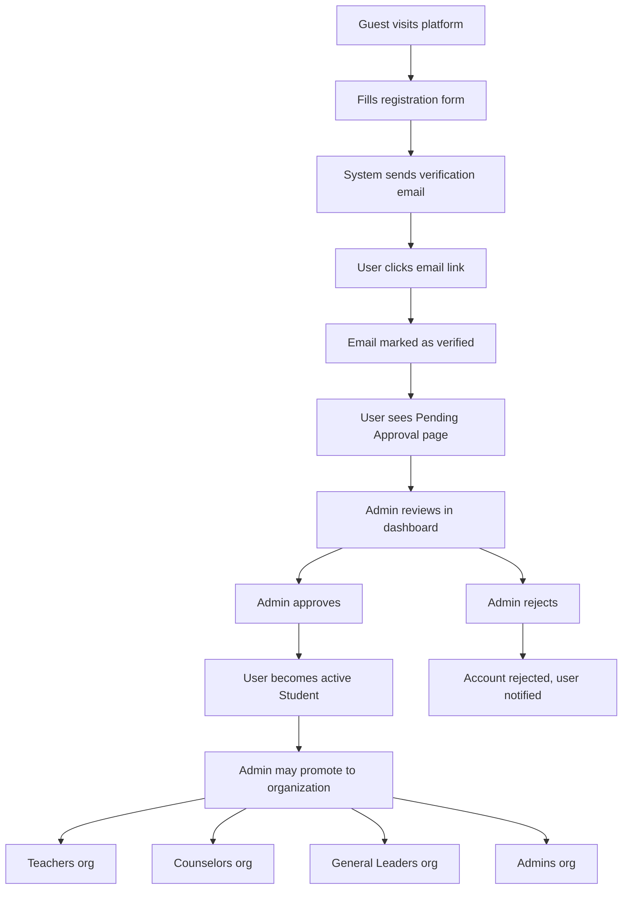

# Authentication Flow

This document covers the complete user authentication journey in Focus Hub — from registration through full platform access. It describes every step, every possible state, and every error condition.

---

## Table of Contents

- [1. Registration](#1-registration)
- [2. Email Verification](#2-email-verification)
- [3. Admin Approval](#3-admin-approval)
- [4. Login](#4-login)
- [5. First User — Auto-Admin](#5-first-user--auto-admin)
- [6. User States](#6-user-states)
- [7. Error States & Edge Cases](#7-error-states--edge-cases)
- [8. Session & Protected Routes](#8-session--protected-routes)
- [9. Admin Workflows](#9-admin-workflows)

---

## 1. Registration

### What Happens

A guest fills out the registration form with their university details. The system creates an account and sends a verification email.

### Registration Fields

| Field | Type | Required | Notes |
|-------|------|----------|-------|
| `name` | string | Yes | Full name as it appears on university ID |
| `email` | string | Yes | Valid email address |
| `password` | string | Yes | Minimum 8 characters |
| `universityId` | string | Yes | University ID number (helps admin verify identity) |
| `year` | number | Yes | University year (1–7) |
| `department` | string | No | Academic department |

### Registration Flow

```
Guest fills form → Submits → BetterAuth creates user record
                                  ↓
                          System sets:
                            - approved = false
                            - emailVerified = false
                                  ↓
                          BetterAuth sends verification email
                                  ↓
                          User redirected to "Check your email" page
```

### Frontend Route

`/signup` — renders the registration form

### API Endpoint

`POST /api/auth/sign-up/email` — handled by BetterAuth's catch-all route

### After Successful Registration

The user sees a message: "We sent a verification link to your email. Please check your inbox and click the link."

The user **cannot log in** until they:
1. Verify their email (Step 2)
2. Get approved by an admin (Step 3)

---

## 2. Email Verification

### What Happens

The user receives an email with a verification link. Clicking the link marks their email as verified.

### Verification Flow

```
User receives email → Clicks verification link
                            ↓
                      BetterAuth validates token
                            ↓
                ┌──── Token valid? ────┐
                │                      │
              Yes                     No
                │                      │
         emailVerified = true    Show error:
         autoSignIn if            "Invalid or expired link"
         configured               + option to resend
                │
         Redirect to
         /pending-approval
```

### Frontend Routes

- `/verify-email?sent=true` — "Check your email" landing page shown after registration
- `/verify-email?token=...` — Callback page when user clicks the verification link

### Two Scenarios on the Verify Email Page

1. **`?sent=true`** — User just registered. Shows: "We sent a verification link to your email. Please check your inbox and click the link."
2. **`?token=<token>`** — User clicked the email link. The page calls `authClient.verifyEmail({ query: { token } })` to validate:
   - **Success:** "Email verified! Your account is now pending admin approval." with a link to `/pending-approval`
   - **Failure:** "Invalid or expired link. Please request a new one." with a resend button

### Resending the Verification Email

If the token is expired or the user lost the email:

```typescript
authClient.sendVerificationEmail({
  email: userEmail,
  callbackURL: "/verify-email",
})
```

---

## 3. Admin Approval

### What Happens

After email verification, the user's account is in a "pending approval" state. An admin must manually review and approve the account before the user can fully access the platform.

### Why Manual Approval?

Focus Hub is a **private platform** exclusively for Focus ASTU members. The approval mechanism:
- Prevents unauthorized access
- Protects internal academic and counseling resources
- Maintains community trust and security
- Allows the admin to verify the user's university ID against membership records

### Approval Flow

```
User's email is verified → Account appears in Admin dashboard
                                      ↓
                              Admin reviews:
                                - Name
                                - Email
                                - University ID
                                - Year
                                - Department
                                      ↓
                          ┌── Admin decides ──┐
                          │                   │
                       Approve             Reject
                          │                   │
                    approved = true     User notified
                    User becomes         with optional
                    active Student       rejection reason
```

### Admin Dashboard

**Route:** `/admin/users`

Displays a table of pending users:

| Column | Source |
|--------|--------|
| Name | `user.name` |
| Email | `user.email` |
| University ID | `user.universityId` |
| Year | `user.year` |
| Department | `user.department` |
| Registered | `user.createdAt` (formatted) |
| Actions | Approve / Reject buttons |

### API Endpoints

- `GET /api/v1/admin/users` — List pending users (admin only)
- `POST /api/v1/admin/users/[id]/approve` — Approve or reject a user
  - Body: `{ action: "approve" }` or `{ action: "reject", reason: "..." }`

### What the User Sees While Pending

**Route:** `/pending-approval`

A status page showing:
- Heading: "Account Pending Approval"
- Message: "Your email has been verified. An administrator will review your account shortly."
- The user's name and university ID
- A "Check Status" button to re-check approval status
- A "Log Out" button

---

## 4. Login

### What Happens

An approved user enters their email and password to sign in.

### Login Flow

```
User enters email + password → BetterAuth validates credentials
                                        ↓
                               ┌── Credentials valid? ──┐
                               │                        │
                             Yes                       No
                               │                        │
                        Check emailVerified       Show: "Invalid
                               │                  email or password"
                     ┌── Verified? ──┐
                     │               │
                   Yes              No
                     │               │
               Check approved    Show: "Please verify
                     │            your email first"
              ┌── Approved? ──┐
              │               │
            Yes              No
              │               │
         Create session    Redirect to
         Redirect to       /pending-approval
         /dashboard
```

### Two-Step Verification on Login

1. **Email verified?** — Handled automatically by BetterAuth when `requireEmailVerification: true`. If not verified, login is blocked with a 403 error.

2. **Admin approved?** — Checked via a `databaseHooks.session.create.before` hook. If `approved === false`, login is blocked with a 403 error containing the message "Your account is pending admin approval."

### Frontend Route

`/login` — renders the login form (email + password)

### Error States

| Error | HTTP Status | User Message | UI Behavior |
|-------|------------|-------------|-------------|
| Invalid credentials | 401 | "Invalid email or password" | Show inline error |
| Email not verified | 403 | "Please verify your email first. Check your inbox." | Show inline error + resend option |
| Account not approved | 403 | "Your account is pending admin approval" | Redirect to `/pending-approval` |
| Account banned | 403 | "Your account has been suspended" | Show inline error |
| Network error | — | "Connection error. Please try again." | Show inline error |

### After Successful Login

User is redirected to `/dashboard` where the UI adapts based on their roles (which organizations they belong to).

---

## 5. First User — Auto-Admin

### What Happens

The very first person to register on the platform is automatically promoted to Admin. This bootstraps the system so there is someone who can approve subsequent users.

### Auto-Admin Flow

```
First user registers → BetterAuth creates user record
                              ↓
                       databaseHooks.user.create.after fires
                              ↓
                       Check: is user count === 1?
                              ↓
                            Yes
                              ↓
                       1. Set role to "admin" via auth.api
                       2. Set approved = true (auto-approve)
                       3. Create default organizations:
                          - teachers
                          - counselors
                          - general-leaders
                          - admins
                       4. Add user to "admins" org as owner
```

### What the First User Experiences

1. Registers normally
2. Verifies email normally
3. **Skips the "pending approval" step** (auto-approved)
4. Lands on the dashboard as a fully functional Admin
5. Can immediately start approving other users

### Important

- The second user and all subsequent users follow the normal flow (pending approval)
- Only the first user ever gets auto-promoted
- The first user is automatically added as the owner of the `admins` organization

---

## 6. User States

A user account can be in one of these states at any point:

| State | `emailVerified` | `approved` | Can Log In? | What They See |
|-------|----------------|-----------|-------------|---------------|
| **Just Registered** | `false` | `false` | No | "Check your email" page |
| **Email Verified** | `true` | `false` | No (403 on login) | `/pending-approval` page |
| **Approved (Active)** | `true` | `true` | Yes | Dashboard |
| **Rejected** | `true` | `false` (rejected) | No | Rejection notice |
| **Suspended** | `true` | `true` (but suspended) | No | Suspension notice |
| **Banned** | `true` | `true` (but banned) | No | Ban notice |

### State Transitions

```
Just Registered → (verify email) → Email Verified
Email Verified → (admin approves) → Approved
Email Verified → (admin rejects) → Rejected
Approved → (admin suspends) → Suspended
Approved → (admin bans) → Banned
Suspended → (admin reinstates) → Approved
```

---

## 7. Error States & Edge Cases

### Registration Errors

| Condition | Response |
|-----------|----------|
| Email already registered | "An account with this email already exists" |
| Missing required fields | Field-level validation errors |
| Password too short (< 8 chars) | "Password must be at least 8 characters" |
| Invalid email format | "Please enter a valid email address" |

### Verification Errors

| Condition | Response |
|-----------|----------|
| Token expired | "Your verification link has expired. Request a new one." |
| Token invalid/malformed | "Invalid verification link." |
| Token already used | "Email already verified." (may redirect to login) |

### Login Errors

| Condition | Response |
|-----------|----------|
| Wrong email/password | "Invalid email or password" |
| Email not verified | "Please verify your email first" |
| Account pending approval | Redirect to `/pending-approval` |
| Account banned | "Your account has been suspended" |
| Account rejected | "Your registration was not approved" |

### Edge Cases

| Case | Behavior |
|------|----------|
| User tries to register with an already-verified email | BetterAuth returns "User already exists" |
| User clicks verification link after already being verified | Graceful handling — redirect to login or pending-approval |
| Admin approves a user who hasn't verified email yet | Should not happen — admin dashboard only shows email-verified users in the pending list |
| User is in pending-approval and tries to access /dashboard | Redirected back to /pending-approval |
| Multiple browser tabs open during verification | Token can only be used once; second tab shows "already verified" |

---

## 8. Session & Protected Routes

### Session Management

BetterAuth handles session creation and management. Sessions are stored as cookies via the `nextCookies()` plugin.

### Getting the Session (Server Side)

```typescript
import { auth } from "@/core/auth/infrastructure/config/auth"
import { headers } from "next/headers"

const session = await auth.api.getSession({ headers: await headers() })
```

The session object includes:
- `session.user.id`
- `session.user.email`
- `session.user.name`
- `session.user.emailVerified`
- `session.user.approved`
- `session.user.universityId`
- `session.user.year`
- `session.user.department`

### Getting the Session (Client Side)

```typescript
import { authClient } from "@/lib/auth-client"

const { data: session } = authClient.useSession()
```

### Route Protection Decision Tree

```
Is there a session?
  │
  ├── No → redirect to /login
  │
  └── Yes → Is user approved?
              │
              ├── No → redirect to /pending-approval
              │
              └── Yes → Does this page require a specific role?
                          │
                          ├── No → render page
                          │
                          └── Yes → Is user in the required org?
                                      │
                                      ├── No → redirect to /dashboard
                                      │
                                      └── Yes → render page
```

---

## 9. Admin Workflows

### Approving a User

1. Admin navigates to `/admin/users`
2. Views the table of pending users (email verified, not yet approved)
3. Reviews the user's name, email, university ID, year, department
4. Clicks "Approve"
5. System sets `approved = true`
6. User can now log in and access the platform as a Student

### Rejecting a User

1. Admin navigates to `/admin/users`
2. Views the pending user
3. Clicks "Reject"
4. A modal appears for an optional rejection reason
5. Admin submits
6. User is marked as rejected
7. User is notified (if notification system is in place)

### Promoting a User to an Elevated Role

1. Admin navigates to `/admin/organizations`
2. Selects an organization (e.g., "Teachers")
3. Searches for the user by name or email
4. Clicks "Add to Organization"
5. The user is added as a member of that organization
6. The user now has all permissions granted by that role
7. The same user can be added to additional organizations for multiple roles

### Suspending a User

1. Admin navigates to user management
2. Finds the user
3. Clicks "Suspend"
4. The user's access is temporarily restricted
5. The suspension is logged with Admin ID, timestamp, and reason

### Banning a User

1. Admin navigates to user management
2. Finds the user
3. Clicks "Ban"
4. Confirms the action (required for destructive actions)
5. The user's access is permanently blocked
6. The ban is logged

### Viewing All Users

The admin can filter users by status:
- **Pending** — Email verified, waiting for approval
- **Approved** — Active users
- **Rejected** — Previously rejected registrations
- **Suspended** — Temporarily restricted
- **Banned** — Permanently blocked

---

## Visual Summary


